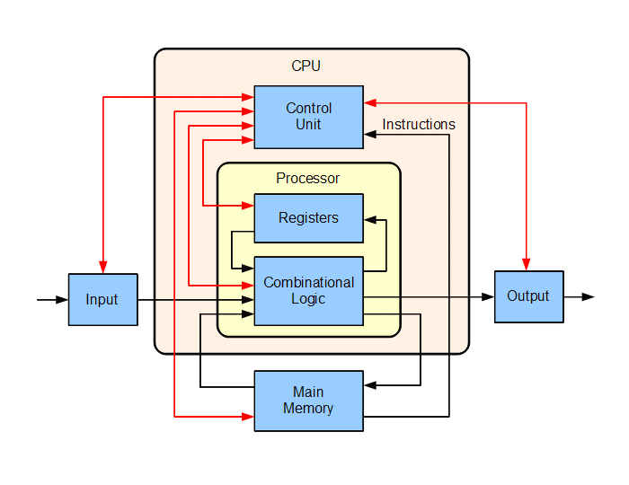

# History about Programming Languages & Computer

Chúng ta có thể khái quát lịch sử máy tính bằng bài viết khác, nhưng sau thời gian dài phát triển, thì công dụng chủ yếu của máy tính là để tính toán dựa trên input và sinh ra output. Máy tính ở thời điểm ban đầu có kích thước rất to ( bằng cả căn phòng), theo thời gian chuyển dời thì kích thước ngày càng giảm dần bởi vì CPU (Central Processing Unit) - lõi của máy tính càng ngày càng nhỏ dựa vào công nghệ nano. Thời điểm ban đầu, CPU được chế tạo dựa trên bóng đèn dây tóc - biểu thị trạng thái bật (số 0) và tắt (số 1). Công nghệ phát triển giúp chúng ta thay thế bóng đèn bằng bóng bán dẫn nhỏ hơn bóng đèn cả nghìn lần. Nhờ vào việc thay đổi sử dụng transistor (bóng bán dẫn) vào việc chế tạo CPU khiến cho kích thước CPU càng ngày càng nhỏ (đồng thời dẫn tới kích thước máy tính ngày càng nhỏ dần). Có một định luật gọi là Moore phát biểu rằng, cứ sau một chu kỳ thời gian nhất định thì số lượng transistor trên một đơn vị diện tích ( $cm^2$ ) sẽ tăng gấp đôi. Công nghệ nano còn có nhiều không gian để phát triển, chu kỳ của Moore's Law là 2 năm (Đến thời gian hiện tại thì mình không dám chắc vì không biết rõ là công nghệ nano có thể đạt tới kích thước bao nhiêu. Theo thông tin tham khảo thì 1 transistor đạt kích thước 0.2 nanometer - $10^{-9}$ meter). Bởi vì lí do chỉ có thể sử dụng 2 trạng thái on/off (cho dòng điện chạy qua) của một bóng đèn / transistor nên máy tính chỉ hiểu được số nhị phân. Kết hợp các transistor và các mạch logic khiến cho CPU có thể thực hiện việc tính toán. Và computer được gọi là bởi computer bởi vì được sinh ra với mục đích là **compute**.

CPU của máy tính được dựa trên những thành phần cơ bản gồm ALU (Arithmetic & Logic Unit - Bộ xử lý tính toán), Main Memory (Bộ nhớ chính), CU (Control Unit - Bộ điều khiển) và các thành phần khác như cache, register, et cetera. Chúng ta khiến computer thực hiện tác vụ bằng việc sử dụng instructions set ( bộ lệnh) phù hợp đã được định nghĩa sẵn bởi mỗi nhà thiết kế. Mỗi máy tính có một đặc điểm khác nhau như việc thiết kế kiến trúc, thiết kế các ALU khác nhau (cùng 1 việc thực hiện phép toán + nhưng có nhiều cách) nên instructions set cũng khác nhau nốt. Các developer/scientist thực hiện công việc xây dựng các chương trình hằng ngày bằng việc sử dụng instructions set bằng mã nhị phân. Điểm yếu của phương pháp này là chương trình viết trên một máy tính sẽ không chạy trên máy tính khác kiến trúc.

Các instructions set này còn được gọi là **machine language/binary language**, đây là loại ngôn ngữ lập trình sơ khai nhất. Programming language (ngôn ngữ lập trình) được tạo ra bởi con người, được sử dụng nhằm mục đích giao tiếp với máy tính, khiến cho máy tính thực hiện các hành vi do người dùng (developer/scientist) chỉ định.

# Classification of Programming Language

Có rất nhiều cách để phân loại ngôn ngữ lập trình dựa trên nhiều tiêu chí. Một tiêu chí hay dùng nhất là dựa trên độ khó của việc viết, và một vài tiêu chí khác: **low-level** & **high-level**, hai loại ngôn ngữ này có các đặc điểm sau:
- low-level:
    - machine langugage
    - assembly language
- high-level:
    - structural language
    - procedural language
    - object oriented language
    - functional language

Ưu điểm của ngôn ngữ low-level rất rõ ràng: siêu nhanh, chạy trực tiếp trên CPU. Tuy nhiên yếu điểm cũng không kém cạnh: chỉ gồm bit 0 hoặ 1 (machine code) dẫn tới khó đọc, khó đọc, khó viết, dể ẩn tàng lỗi, khó bảo trì. Một điểm phát triển của assembly code so với machine code là có thể sử dụng english word (dễ nhớ) cải thiện code đáng kể. Tuy nhiên vẫn rất để lập trình, và đặc biệt là không có cấu trúc rõ ràng, chỉ gồm một list instructions. Yêu cầu cần assembler để phiên dịch assembler code thành machine code. Tuy nhiên vẫn cần assembler khác nhau dành cho mỗi máy tính

Ưu của của ngôn ngữ high-level thì không cần ai phải bàn cãi: viết code một cần, có thể chạy ở hầu hết loại máy tính. Câu lệnh tiếng anh rất dễ đọc và dễ viết, cung cấp khả năng trừu tượng. Yếu điểm là phải cần một compiler/interpreter khác nhau cho mỗi loại máy tính. Điều cần phải củng cố compiler/interpreter cho từng loại kiến trúc (x86,et cetera). Ưu điểm rất là rõ ràng, và ai cũng sử dụng high-level language nên việc phân loại tiếp theo sẽ tập trung vào các high-level language.

# Structured Programming & Procedural Programming

# Objet Oriented Programming & Functional Programming

# Prototype ? How Javascript implement OOP 

# this & relevants concepta

# Better Method

---
# References & more resources
- https://qz.com/852770/theres-a-limit-to-how-small-we-can-make-transistors-but-the-solution-is-photonic-chips/
- https://en.wikipedia.org/wiki/Computer
- https://www.youtube.com/watch?v=Pn5znSOGHcs
- https://www.youtube.com/watch?v=aYjGXzktatA
- https://www.youtube.com/watch?v=A38y7OO8OK4