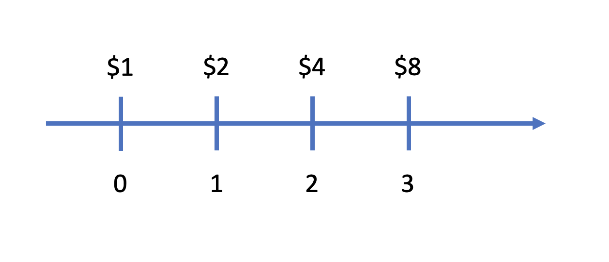
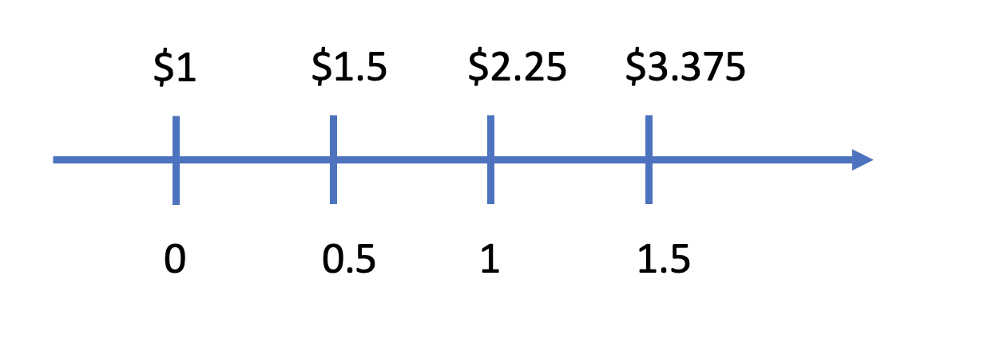
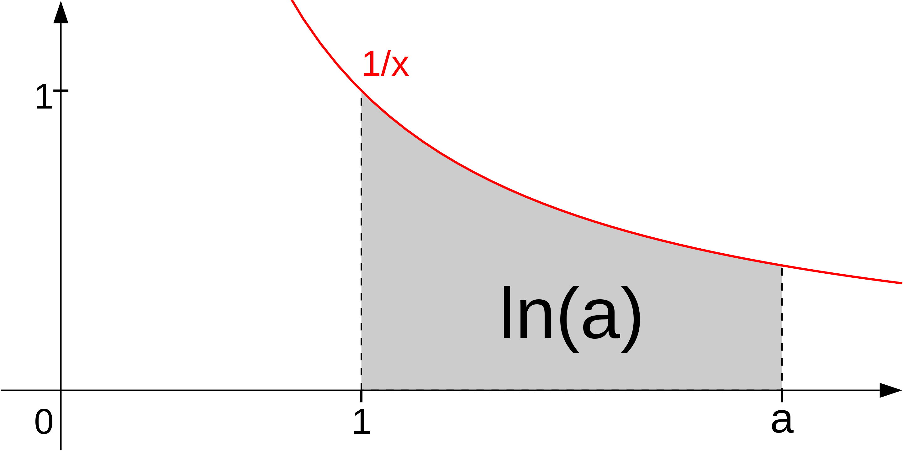
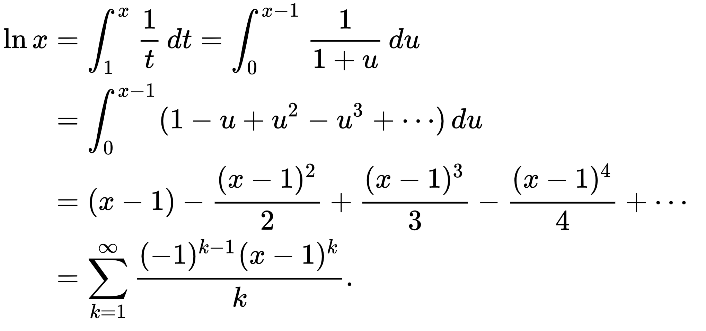

Một trong nhiều vấn đề khá là nan giải (thực ra không phải là nan giải, "người ta" đã giải quyết nó từ lâu rồi - từ có nghĩa là cách tiếp cận khó khăn) trong lập trình, hoặc toán học đó là phép toán luỹ thừa. Một câu hỏi có thể hay được đặt ra đó là: "Làm sao để tính luỹ thừa bậc n của một số bất kỳ?". Vấn đề trở nên rất đơn giản nếu như chúng ta sử dụng các ngôn ngữ lập trình Javascript, Python, hoặc là các thư viện kèm theo của các ngôn ngữ bậc thấp như *math.h* của C / *cmath* của C++. Nhưng trong trường hợp không không thể sử dụng các built-in, chúng ta tính luỹ thừa như thế nào?

# Exponent as natural number
Bằng một vài định nghĩa toán học cơ bản, ta biết được rằng phép toán luỹ thừa là việc thực hiện các phép nhân liên tục. Cụ thể hơn, *base* được nhân với chính bản thân *n* lần.

$$
 \underbrace{b^n = b.b.b...b}_\text{n times} 
$$

Bằng định nghĩa này thì ta có thể tự implement như sau
```javascript
function pow(base,deg){
    let p = 1;
    for(let i=0;i<deg;i++){
        p = p*base
    }
    return p;
}
```

Tuy nhiên chỉ có bấy nhiêu đây thì vẫn chưa đủ, ta cần phải cover cả các trường hợp đặc biệt như là `NaN, 0, 1, infinity`. Ta cũng có thể dựa trên các định nghĩa trên để cải tiến hàm `pow` tốt hơn.

```javascript
function pow(base,exdegp){
    if (base == 1 || base == 0) return base;
    if (deg == 0) return 1;
    if (deg == 1) return base;
    if (isNaN(base) || isNaN(deg)) return NaN;
    if (!isFinite(base) || !isFinite(deg)) return Infinity;

    let p = 1;
    for(let i=0;i<deg;i++){
        p = p*base
    }
    return p;
}
```
Như vậy thì chúng ta đã có thể tự implement một hàm luỹ thừa manually mà không dựa vào thư viện. Tuy vậy, thực sự thì hàm luỹ thừa này vẫn còn thiếu sót rất nhiều, cụ thể là **Nếu số mũ của chúng ta số thực thì sao?** Đến đây thì đoạn code ở trên lại không thể giúp chúng ta, vì chúng ta không thể lặp "số thực" lần được.

# Logarithms
Cái gì cũng có mặt trái của nó, (chỉ có bản mặt của tôi là không có người yêu), ngoại trừ phép **power** thì chúng ta còn có phép toán **logarithm**. Phép toán **logarithm** giúp chúng ta tìm được **exponent** của một số. Tuy nhiên dựa vào những kiến thức hạn hẹp của tôi về toán và cả lập trình thì tôi chưa nghĩ ra cách nào để cài đặt hàm logarithm bằng vòng lặp đơn giản như phép luỹ thừa vậy. Chúng ta hãy tìm hiểu một chút về phép logarithm và **e** - magical number. 

$$
    a^n = b \newline
    \log_a b = n
$$

Nhìn vào công thức quen thuộc này thì chúng ta có thể nhận ra rằng là, nếu chúng ta biết cách tính hàm logarithm thì mọi chuyện sẽ trở nên dễ dàng khi tìm số mũ. Nhưng mà mọi chuyện đâu có dễ như vậy, bởi vì chúng ta đang giậm chân tại chỗ ở hàm power (chỉ có thể tính được luỹ thừa là số nguyên), vậy nên n sẽ luôn luôn là số nguyên (với cái cách tính hàm power ở trên đã được mình đề ra). Chúng ta cần một cách tính khác có thể giúp chúng ta tính được power với exponent là số thực, cách này này thông qua **e**.

# Magical number
Tầm quan trọng của e trong giải tích thì không ai phải bàn cãi, nó thực sự rất là quan trọng luôn (quan trọng tới mức tôi không thể sống thiếu e). **Vậy e được tìm ra như thế nào và ý nghĩa của e là gì?** Để làm rõ vấn đề này thì chúng ta sẽ nói về **growth** - sự tăng trưởng. Chúng ta sẽ lấy ví dụ về compound interest để dễ hình dung hơn về growth. Đặc biệt khi tính toán lãi kép thì đơn vị thời gian chúng ta sử dụng là số nguyên.

$$
    A = P(1 + \frac{r} {n})^{nt}
$$

- A: Số tiền cuối cùng bạn nhận được
- P: Số tiền ban đầu
- r: Tỉ lệ lãi
- n: Số lần áp dụng lãi kép ()
- t: Thời gian một chu kỳ (áp dụng lãi kép)


Chúng ta sẽ bắt đầu với 
- P: 1 ($)
- r: 1 (100%)
- n: 3 (lần)
- t: 1 (năm)



Nhìn qua hình này ta có thể nhận ra đây vừa là ví dụ của lãi kép, và vừa là ví dụ power 2 với số mũ là số tự nhiên. Tới đây thì chúng ta sẽ bắt đầu chia số mũ thành từng đoạn nhỏ. Chúng ta thay đổi chu kỳ từ 1 năm thành 6 tháng (hoặc 3) tháng và đồng thời chia nhỏ lãi (thay ví 100% cho 1 năm thì sẽ là 50%/6 tháng và 25%/ 3 tháng) kết quả sẽ như sau:




Vậy khi chúng ta chia lãi càng nhỏ (tới mức $10^{-9}$), thì chúng ta sẽ đạt được growth càng lớn, giá trị này hội tụ lại tại **e = 2.71828...**( ~171% growth per year). e được gọi với cai tên: con số của sự tăng tưởng, luỹ thừa bằng một cách nào cũng được xem là growth (tăng trưởng). e kết quả lớn nhất có thể khi áp dụng lãi kép liên tục ở mức lãi 100% sau một đơn vị thời gian (lãi kép liên tục là việc chia nhỏ lãi ). Và hàm $f(x) = e^x$ được gọi là hàm tăng trưởng (The exponential function). Một điều tuyệt vời rằng giá trị của $f'(x) = e^x$. Một hàm tuyệt vời. Đây là hàm duy nhất tại thời điểm hiện tại có tính chất này. Thực hiện phép log với cơ số e: $\log_e x$, được gọi là natural logarithm. 

# Real exponent
Làm sao để tính $a^b$ với b là số thực? Chúng ta sẽ cần tới phép natural logarithm, cơ số a ta có thể biểu diễn dưới dạng $e^x$ và natural logarithm như sau
$$
    e^a = b \newline \log_e b = a \newline \rightarrow b = e^{\ln b} 
$$

$$
    a^b = (e^{\ln a})^{b} \leftrightarrow a^b = e^{b\ln a}
$$

Có vẻ tới đây thì chúng ta sẽ tính $ e^{b\ln a}$ để có được kết quả của $a^b$ với b là số thực. Nhưng chúng ta lại gặp vấn đề: $\ln a$ có thể là số thực, và chúng ta lại quay vào vòng lẩn quẩn. Tuy nhiên ta có thể giải quyết vấn đề này nếu như cơ số là e (why it is magical) bằng công thức sau (Khai triển Taylor đối với chuỗi luỹ thừa - nhờ vào tính chất $f'(x) = e^x$ nên chúng ta mới có công thức này):

$$
    e^x = \sum_{k=0}^{\infin} \frac{x^k} {k!}
$$


```javascript
function exp(x) {
    // depend ons how many accuracy, we need to specific fixed K, in this example
    let k = 50;
    let factorial = 1;
    let exponent = 1;
    let sum = 1;
    for (let i = 1; i < k; i++) {
        exponent = exponent * x;
        factorial = factorial * i
        sum = sum + exponent / factorial;
    }
    return sum
}
```
Và bây giờ chúng ta tiếp tục hoàn hiện hàm $\ln a$. Theo lý thuyết thì $\ln a$ được định nghĩa là phần diện tích phía dưới đường cong



$$
    \ln a = \int_{1}^{a} \frac{1} {x} \frac{d} {dx}
$$

Và làm sao chúng ta tính được nó khi nguyên hàm của $\int \frac{1} {x} = \ln|x| + C$. Lại một vòng lẩn quẩn mới chăng? Thực ra là chúng ta sẽ dùng phương pháp **Tích phân từng phần** để nguyên hàm và tính, kết quả như sau:

$$
    \ln a = - \ln (1-x) = \sum_k^\infin \frac{x^k} {k} \newline
    a = \frac {1} {1-x} \newline
    \forall a > 1
$$
```javascript
function ln_upper(a) {
    let k = 50;
    let x = 1 - 1 / a;
    let sum = 0;
    let exponent = 1;
    for (let i = 1; i < k; i++) {
        exponent = exponent * x;
        sum = sum + exponent / i
    }
    return sum
}
```
Còn đây là đối với $a \le 1$




```javascript
function ln_lower(a) {
    let k = 50;
    let u = a - 1;
    let sum = 0;
    let exponent = 1;
    for (let i = 1; i < k; i++) {
        exponent = exponent * u;
        sum = sum + (i % 2 == 1 ? 1 : -1) *( exponent / i)
    }
    return sum
}
```


```javascript
function exp(x) {
    // depend ons how many accuracy, we need to specific fixed K, in this example
    let k = 50;
    let factorial = 1;
    let exponent = 1;
    let sum = 1;
    for (let i = 1; i < k; i++) {
        exponent = exponent * x;
        factorial = factorial * i
        sum = sum + exponent / factorial;
    }
    return sum
}
function ln_upper(a) {
    let k = 50;
    let x = 1 - 1 / a;
    let sum = 0;
    let exponent = 1;
    for (let i = 1; i < k; i++) {
        exponent = exponent * x;
        sum = sum + exponent / i
    }
    return sum
}
function ln_lower(a) {
    let k = 50;
    let u = a - 1;
    let sum = 0;
    let exponent = 1;
    for (let i = 1; i < k; i++) {
        exponent = exponent * u;
        sum = sum + (i % 2 == 1 ? 1 : -1) * (exponent / i)
    }
    return sum
}
function ln(a){
    if (a<0) return NaN
    if (a<=1) return ln_lower(a);
    return ln_upper(a)
    
}

function pow(base,deg){
    if (base == 1 || base == 0) return base;
    if (deg == 0) return 1;
    if (deg == 1) return base;
    if (isNaN(base) || isNaN(deg)) return NaN;
    if (isFinite(base) || isFinite(deg)) return Infinity;

    return exp(deg*ln(base));
}
```
---

# References & more resources
- https://www.youtube.com/watch?v=AuA2EAgAegE
- https://www.youtube.com/watch?v=_-x90wGBD8U
- https://en.wikipedia.org/wiki/E_(mathematical_constant)
- https://en.wikipedia.org/wiki/Exponential_function
- https://en.wikipedia.org/wiki/Natural_logarithm
- https://math.stackexchange.com/questions/635787/how-to-calculate-lnx
- https://stackoverflow.com/questions/9799041/efficient-implementation-of-natural-logarithm-ln-and-exponentiation/63773160#63773160
- https://www.netlib.org/fdlibm/e_pow.c

### P/S:
Nếu có gì sai sót xin gửi email cho mình để cập nhật, xin cảm ơn!